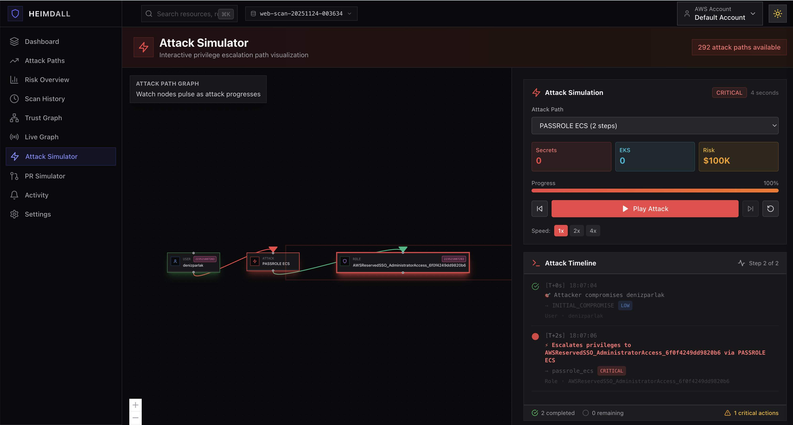
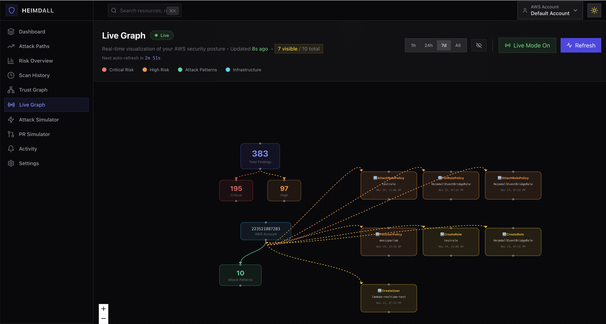
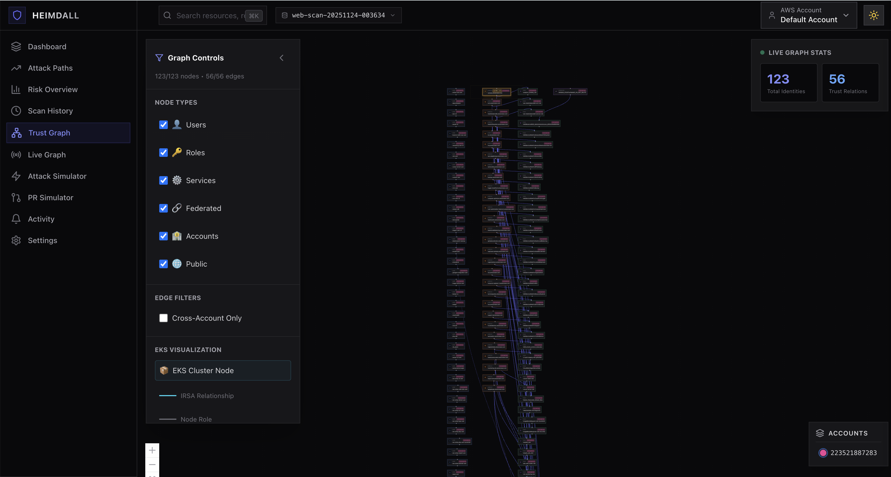
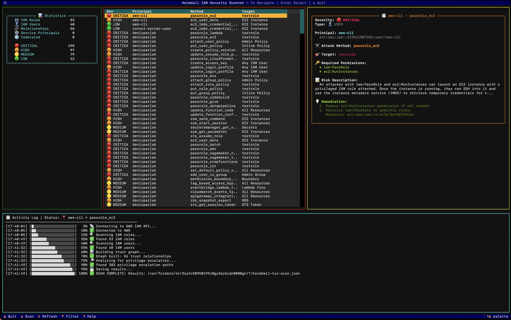
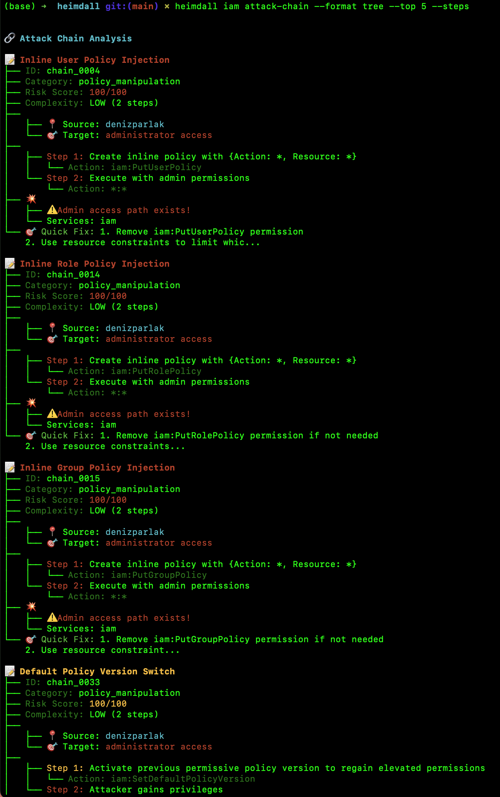
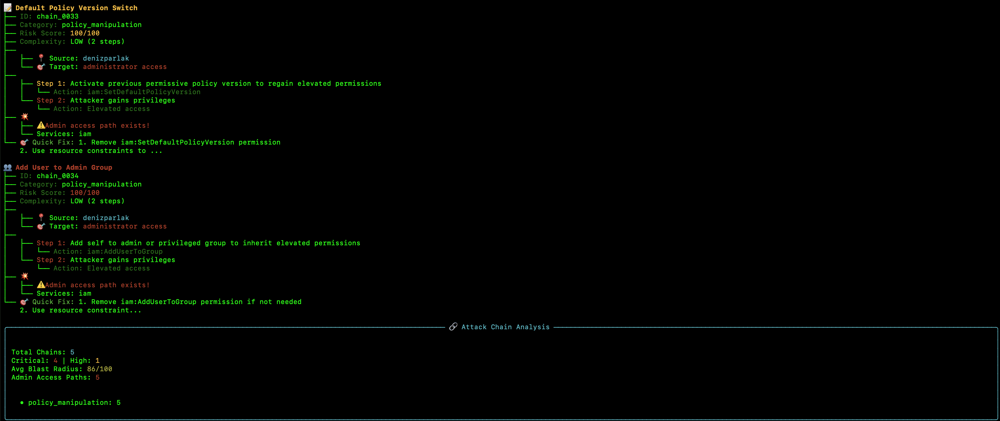

<p align="center">
  
</p>

<h1 align="center">Heimdall</h1>

<p align="center">
  <strong>AWS Attack Path Scanner</strong><br>
  <em>The Bifröst Guardian for Your Cloud Security</em>
</p>

<p align="center">
  <a href="#-quick-start">Quick Start</a> •
  <a href="#-real-world-examples">Examples</a> •
  <a href="#-features">Features</a> •
  <a href="#-installation">Installation</a> •
  <a href="#-commands">Commands</a> •
  <a href="#%EF%B8%8F-roadmap">Roadmap</a>
</p>

<p align="center">
  
  
  
  
</p>

---

## What is Heimdall?

Heimdall is an **AWS security scanner** that discovers privilege escalation paths attackers could exploit to gain admin access.

**By the numbers:**
- 🎯 **50+ IAM privilege escalation patterns** detected
- 🔗 **85+ attack chain patterns** with MITRE ATT&CK mapping  
- 🌐 **10 AWS services** analyzed for cross-service escalation
- ✅ **Low false-positive rate** - tested on production accounts with 50+ roles
- ⚡ **One command** to assess your entire security posture

In Norse mythology, Heimdall stands at Bifröst and sees all paths between realms.  
In AWS, Heimdall watches your environment and reveals all paths to compromise.

### ✨ Key Features

| Feature | Description |
|---------|-------------|
| 🔗 **Attack Chain Analysis** | Multi-step privilege escalation paths with MITRE ATT&CK mapping |
| 🌐 **Cross-Service Scanner** | Analyze 10 AWS services (EC2, RDS, S3, Lambda, KMS, Secrets Manager, STS, SNS, SQS, DynamoDB) |
| 🎨 **Interactive TUI** | Cosy Nordic-themed terminal interface |
| 📊 **One-Command Dashboard** | `heimdall dashboard` - instant security overview |
| 🎯 **50+ Privesc Patterns** | Comprehensive IAM privilege escalation coverage |
| 📤 **CI/CD Ready** | SARIF export for GitHub Security, CSV for spreadsheets |
| 🔒 **Baseline System** | Ignore known/accepted risks with `.heimdall-ignore` |

### 🏢 Enterprise Edition (Preview)

> 🔒 **Limited Access** - Web UI is currently in private preview.  
> Interested in a demo? Contact: **denizparlak@protonmail.ch**

<details>
<summary><b>🖼️ Click to see Web UI Screenshots</b></summary>

<br>

**Attack Simulator** - Interactive privilege escalation visualization


**Live Graph** - Real-time security posture with auto-refresh


**Trust Graph** - IAM trust relationship explorer


</details>

---

## 🚀 Quick Start

```bash
# 1. Install
pip install -e .

# 2. One-command security overview
heimdall dashboard

# 3. Deep privilege escalation analysis
heimdall iam detect-privesc --profile prod
```

**That's it!** You'll see a complete security posture in seconds.

---

## 🧪 Real World Examples

### ✅ Well-Configured Account (No False Positives)
```bash
$ heimdall iam scan --profile prod --summary

✓ Scanned 52 IAM roles
✓ Scanned 40 IAM users
✓ Found 55 assume-role relationships
✓ Identified 0 privilege escalation paths

Summary:
  Roles: 52
  Users: 40
  Service principals: 29
  Federated principals: 1
  Human→Role paths: 1
  Risky paths: 0 (Critical: 0, High: 0)

✅ Good security posture detected:
   - Admin access via SSO only (federated)
   - Minimal user→role permissions
   - Service roles properly isolated
```

### ⚠️ Account with Privilege Escalation Risks
```bash
$ heimdall iam detect-privesc --profile prod

🔐 Heimdall Privilege Escalation Detector

✓ Scanned 52 IAM roles
✓ Scanned 40 IAM users
✓ Detected 14 privilege escalation opportunities

⚠️  Privilege Escalation Opportunities:

CRITICAL (8):
  • user/admin-user
    Method: passrole_lambda
    Create Lambda with privileged role, execute code with elevated permissions

  • user/admin-user
    Method: attach_user_policy
    Attach AdministratorAccess policy to self or other user

HIGH (6):
  • user/admin-user
    Method: create_policy_version
    Modify existing policy to grant admin access
```

### 🔗 Multi-Hop Attack Path Detection
```bash
$ heimdall iam detect-privesc --include-indirect --max-depth 2

🔗 Indirect Privilege Escalation Paths (Multi-Hop):

CRITICAL:
  • user/junior → DevRole → ProdRole
    Path length: 2 hops
    Target: attach_user_policy (CRITICAL)

  • user/contractor → IntegrationRole → DeployerRole → AdminRole
    Path length: 3 hops
    Target: put_user_policy (CRITICAL)

What's detected:
  ✓ Junior devs who can assume roles leading to admin
  ✓ Contractors with indirect paths through role chains
  ✓ Hidden escalation paths not obvious from direct permissions
```

---

## 📸 Screenshots

### 📊 Security Dashboard
> One command to see everything: IAM stats, privilege escalation risks, and recommendations.

```bash
heimdall dashboard --quick
```


### 🎨 Interactive TUI
> Navigate findings, explore attack chains, and drill down into details with keyboard shortcuts.

```bash
heimdall iam tui
```



### 🔗 Attack Chain Analysis
> Multi-step privilege escalation paths with risk scores and quick fix suggestions.

```bash
heimdall iam attack-chain --format tree --top 5 --steps
```



### 🌐 Cross-Service Analysis
> Detect privilege escalation across 10 AWS services (S3, Lambda, EC2, KMS, and more).

```bash
heimdall iam cross-service --compact
```



---

## ⚡ Features

### 🔍 Core Scanning
- **50+ Privilege Escalation Patterns** - Most comprehensive coverage
- **Trust Graph Analysis** - Map all AssumeRole relationships
- **Multi-Hop Detection** - Find indirect escalation paths (A→B→C→Admin)

### 🔗 Attack Chain Analysis
- **85+ Attack Patterns** with MITRE ATT&CK mapping
- **Blast Radius Scoring** (0-100) - Impact assessment
- **Step-by-Step Narratives** - How attacks unfold
- **3 Output Formats** - Table, JSON, Tree

### 🌐 Cross-Service Engine
Analyze privilege escalation across **10 AWS services**:

| Service | Checks |
|---------|--------|
| 🖥️ EC2 | Instance profiles, IMDSv1, public IPs |
| 🛢️ RDS | Public instances, snapshot sharing |
| 🪣 S3 | Public buckets, cross-account, sensitive data |
| ⚡ Lambda | Execution roles, env vars, code injection |
| 🔐 KMS | Key policies, grants, cross-account |
| 🔑 Secrets | Resource policies, rotation status |
| 🔀 STS | Trust policies, cross-account assumptions |
| 📢 SNS | Topic policies, public access |
| 📬 SQS | Queue policies, encryption |
| 🗄️ DynamoDB | Encryption, sensitive tables |

### 🎨 Interactive TUI
- **Nordic-themed** beautiful terminal interface
- **Real-time** finding exploration
- **Keyboard navigation** - vim-style bindings
- **Live scan** progress with logs

### 📊 Dashboard
- **One-command** security overview
- **Risk scoring** (0-100)
- **Severity breakdown** with visual bars
- **Actionable recommendations**

### 📤 Export & Integration
- **SARIF** - GitHub Security Code Scanning
- **CSV** - Excel/Sheets analysis
- **JSON** - CI/CD pipelines
- **Baseline** - Ignore known/accepted risks

---

## 📦 Installation

### Requirements
- Python 3.9+
- AWS credentials configured (`~/.aws/credentials` or environment)

### Install from Source
```bash
git clone https://github.com/DenizParlak/heimdall.git
cd heimdall
pip install -e .
```

### Verify Installation
```bash
heimdall doctor
heimdall --version
```

---

## 🔧 Commands

### Quick Overview
```bash
heimdall dashboard                    # 🎯 One-command security overview
heimdall dashboard --quick            # Skip cross-service (faster)
```

### IAM Scanning
```bash
heimdall iam scan                     # Scan IAM, build trust graph
heimdall iam detect-privesc           # Find privilege escalation
heimdall iam detect-privesc --explain # AI-powered explanations
```

### Attack Analysis
```bash
heimdall iam attack-chain             # Multi-step attack paths
heimdall iam attack-chain --top 10    # Top 10 chains
heimdall iam cross-service            # Cross-service escalation
heimdall iam cross-service --compact  # Summary only
```

### Interactive Mode
```bash
heimdall iam tui                      # Interactive terminal UI
heimdall iam tui --graph scan.json    # Load existing scan
```

### Export & CI/CD
```bash
# SARIF for GitHub Security
heimdall iam detect-privesc --format sarif -o findings.sarif

# CSV for spreadsheets
heimdall iam detect-privesc --format csv -o findings.csv

# With baseline (ignore known risks)
heimdall iam detect-privesc --baseline .heimdall-ignore
heimdall iam detect-privesc --init-baseline  # Create sample file
```

### Utilities
```bash
heimdall quickstart                   # Interactive setup guide
heimdall doctor                       # Health check
heimdall aws profiles                 # List AWS profiles
heimdall completion zsh               # Shell completion
```

---

## 🔐 Required IAM Permissions

Minimum permissions for Heimdall to scan your account:

```json
{
  "Version": "2012-10-17",
  "Statement": [
    {
      "Effect": "Allow",
      "Action": [
        "iam:List*",
        "iam:Get*",
        "sts:GetCallerIdentity"
      ],
      "Resource": "*"
    }
  ]
}
```

For cross-service scanning, add:
```json
{
  "Action": [
    "s3:ListAllMyBuckets",
    "s3:GetBucketPolicy",
    "lambda:ListFunctions",
    "lambda:GetFunction",
    "ec2:DescribeInstances",
    "kms:ListKeys",
    "secretsmanager:ListSecrets"
  ],
  "Resource": "*"
}
```

---

## 🗺️ Roadmap

### ✅ Completed
- [x] 50+ IAM privilege escalation patterns
- [x] Attack chain analysis with MITRE mapping
- [x] Cross-service scanner (10 services)
- [x] Interactive TUI
- [x] One-command dashboard
- [x] SARIF/CSV export
- [x] Baseline/ignore system

### 🔜 Coming Soon
- [ ] Slack/Teams alerts
- [ ] Terraform native integration
- [ ] Multi-account organization scanning
- [ ] Compliance framework mapping (CIS, PCI-DSS)
- [ ] Auto-remediation suggestions

---

## 🤝 Contributing

Contributions welcome! Please read [CONTRIBUTING.md](CONTRIBUTING.md) first.

```bash
# Run tests
pytest

# Run linting
ruff check heimdall/
```

---

## 📄 License

MIT License - see [LICENSE](LICENSE) for details.

---

## 🙏 Credits

Built with:
- [Python](https://python.org/) - 3.9+
- [boto3](https://boto3.amazonaws.com/) - AWS SDK for Python
- [Click](https://click.palletsprojects.com/) - CLI framework
- [Rich](https://rich.readthedocs.io/) - Terminal formatting
- [Textual](https://textual.textualize.io/) - TUI framework

---

<p align="center">
   <strong>Guard your cloud like Heimdall guards Bifröst</strong><br>
  <em>Made with ❤️ for the AWS security community</em>
</p>
